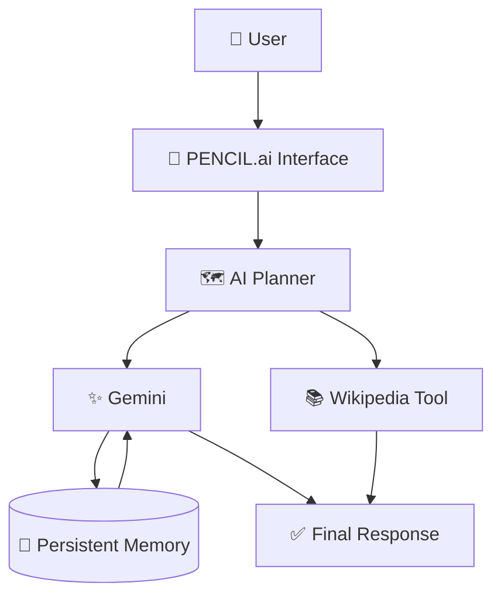
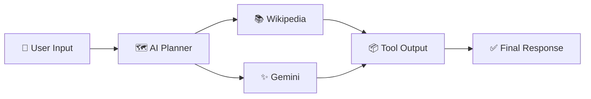

# PENCIL.ai 🧠🔬

> **A modular, 🛠️ tool-using AI assistant built from the ground up — with persistent 💾 conversational memory and intelligent 🎯 planning.**

PENCIL.ai is an experimental 🧪 AI system focused on one question:

**What happens when an AI assistant is designed not just to generate answers, but to decide *how* an answer should be produced? 🤔**

Instead of treating every user message as a simple prompt → response interaction, PENCIL.ai is being developed as a modular 🧩 system where different kinds of work can be routed through different capabilities.

---

## ✨ What PENCIL.ai Can Do

### 💬 Conversational AI

PENCIL.ai maintains persistent conversation history using a local 📄 `chat_history.txt` file.

When the application starts again 🔄, previous conversations can be loaded and supplied to Gemini ✨ so the assistant can continue from where the user left off.

```text
User 🙋
 │
 ▼
New Question ❓
 │
 ▼
Load Previous Conversation 📂
 │
 ▼
Gemini ✨
 │
 ▼
Answer 💡
 │
 ▼
Save New Conversation 💾
 │
 └──────────────► chat_history.txt
```

This gives PENCIL.ai a simple form of **persistent external memory 🧠** without pretending that the language model itself permanently remembers previous application sessions.

---

# 🧠 System Architecture

At a high level, PENCIL.ai runs on a single core loop ⚙️: user input flows through a Planner 🗺️, which decides which tool 🔧 should act, backed by persistent memory 💾.



### Core Loop 🔁

```text
User 🙋
 ↓
Planner 🗺️
 ↓
Selected Tool 🔧
 ↓
Gemini ✨
 ↕
Persistent Conversation Memory 💾
 ↓
Response ✅
```

This keeps the system lightweight ⚡ while still leaving room for new tools to be plugged in later 🔌.

---

# 🧩 Planner & Tool Architecture

One of the core ideas behind PENCIL.ai is **tool orchestration 🎻**.

Instead of hard-coding:

```python
if "history" in question:
    wiki()
```

the system is being designed around specialized tools 🧰 that can be selected by a Planner.

Conceptually:



This architecture allows new tools to be added without rewriting the entire application 🚫🔨.

For example, a future tool registry could conceptually look like:

```python
TOOLS = {
    "wiki": wiki,       # 📚
    "gemini": talk_gemini,  # ✨
}
```

The Planner decides **which capability should handle the task 🎯**, while the tool itself performs the work 💪.

---

# 🎯 Engineering Goals

PENCIL.ai is being developed around several practical AI problems.

### 1. 🌀 Hallucination

A fluent answer is not automatically a trustworthy answer ⚠️.

Where possible, answers are grounded 🌍 against external tools (like Wikipedia 📚) instead of relying exclusively on model knowledge.

Future versions will explore explicit evidence verification ✅ and confidence estimation 📊.

### 2. 🧹 Context Pollution

Simply storing an unlimited transcript is not a scalable memory architecture 📈❌.

The current text-file memory is an intentionally simple starting point 🌱.

Future memory work may include:

```text
Raw Conversation 📝
      ↓
Memory Extraction ⛏️
      ↓
Important Facts / Decisions 💡
      ↓
Indexed Memory 🗂️
      ↓
Relevant Memory Retrieval 🔍
      ↓
Gemini ✨
```

### 3. 🛡️ Fault Tolerance

Real AI systems depend on APIs and networks 🌐.

Future versions will need to handle:

- 💥 API failures
- ⏱️ timeouts
- 🧩 malformed responses
- 🚦 rate limits
- 🔄 fallback tools

---

# 🛠️ Technology Stack

| Component | Technology | Role |
|---|---|---|
| 🐍 Core language | Python | Application logic |
| ✨ General AI | Google Gemini API | Conversation & planning |
| 📚 Historical knowledge | Wikipedia API | Location-specific knowledge |
| 💾 Persistent memory | Local text file | Conversation storage |
| 🌐 HTTP | `requests` | API communication |

The project intentionally uses relatively simple 🌱 building blocks so the underlying architecture remains understandable 🔍.

---

# 📁 Conceptual Project Structure

The project is being organized toward a modular architecture 🧩:

```text
PENCIL.ai/
│
├── main.py 🚀
│
├── planners.py 🗺️
│
├── tools/ 🧰
│   ├── wikipedia.py 📚
│   └── ...
│
├── memory/ 💾
│   └── chat_history.txt
│
└── README.md 📄
```

> The exact file organization may evolve as the project grows 🌱.

---

# 🔄 Example: Normal Conversation

```text
User 🙋:
"Where did we leave off with Pencil.ai?"

        ↓

PENCIL.ai loads 📂:
chat_history.txt

        ↓

Previous conversation 💬
        +
Current question ❓

        ↓

Gemini ✨

        ↓

Context-aware response 🎯

        ↓

New exchange saved 💾
```

The model does not need magical permanent memory 🪄.

The application supplies the memory 💾.

---

# 🧪 Development Philosophy

PENCIL.ai is being built incrementally 🧱.

The objective is not:

> "Add as many AI APIs as possible." ❌

Instead:

> **Identify a real weakness 🔍 → design a small component 🧩 → test it 🧪 → measure it 📊 → improve it 📈**

For example:

```text
Problem 🧩
   ↓
Hypothesis 💭
   ↓
Implementation 🛠️
   ↓
50 Test Questions ❓
   ↓
Measure Performance 📊
   ↓
Analyze Failures 🔎
   ↓
Improve Architecture 📈
   ↓
Test Again 🔁
```

This makes PENCIL.ai both a software project 💻 and an ongoing AI engineering experiment 🧪.

---

# 📊 What Makes the Project Interesting

PENCIL.ai explores several concepts that appear in modern AI systems:

- 🤖 Agentic workflows
- 🔧 Tool calling
- 🗺️ Task planning
- 💾 Persistent external memory
- 🔀 Multi-model architecture readiness
- 🛡️ Failure handling
- 🧹 Context management
- 🧩 Modular AI architecture

The project is intentionally being developed from relatively simple Python primitives 🐍 rather than hiding the interesting parts behind a large agent framework 🏗️.

---

# 🚧 Current Limitations

PENCIL.ai is still an experimental system 🧪.

Current limitations include:

- 📄 Conversation memory currently relies on a plain text file.
- 📈 Sending the complete history can become inefficient as it grows.
- 🌐 External API availability affects system reliability.
- 🗺️ The Planner can be improved through systematic evaluation.
- 🔒 Security against malicious/untrusted content is an area for future work.
- 🧪 There is not yet a mature automated evaluation suite.

These are not hidden limitations — they are part of the engineering roadmap 🛣️.

---

# 🗺️ Roadmap

### Phase 1 — Foundation ✅

- [x] ✨ Gemini conversation
- [x] 💾 Persistent conversation history
- [x] 🧹 `.clear` memory command
- [x] 🧩 Tool-based architecture
- [x] 📚 Wikipedia tool

### Phase 2 — Memory Intelligence 🔮

- [ ] 📝 Memory summarization
- [ ] 💡 Important-fact extraction
- [ ] 🔍 Relevant-memory retrieval
- [ ] 🗂️ Long-term memory indexing
- [ ] 🗜️ Conversation compression

### Phase 3 — Robust Agent Architecture 🔮

- [ ] 🩹 Tool failure recovery
- [ ] 🔁 Retry strategies
- [ ] 🔄 Fallback tools
- [ ] 🛡️ Prompt-injection defenses
- [ ] 🧱 Structured Planner decisions
- [ ] 🧪 Automated evaluation

---

# 🧠 Design Principle

PENCIL.ai follows a simple idea:

> **The model should not always do everything 🚫. The system should decide what kind of intelligence the problem requires 🎯.**

🧮 A calculator should calculate.

🔍 A search engine should retrieve.

✍️ A writer should communicate.

🗺️ A Planner should decide **which one should act next**.

That separation of responsibilities is the foundation of PENCIL.ai 🏛️.

---

# 📌 Project Status

**Status:** Active experimental development 🧪🚧

**Focus:** 🤖 AI agents, 🔧 tool orchestration, 💾 memory architecture, and 🛡️ trustworthy AI.

PENCIL.ai is currently being built incrementally 🧱, with new capabilities introduced only after understanding and testing the previous layer 🔍.

---

## 🌌 Final Thought

> *"The interesting question isn't whether an AI can answer a question. It's whether we can build a system that knows what it needs before answering it."* 💭

PENCIL.ai is an attempt to explore exactly that 🚀.

**Search 🔍. Remember 🧠. Reason 🤔. Improve 📈.** 🧠🔬
